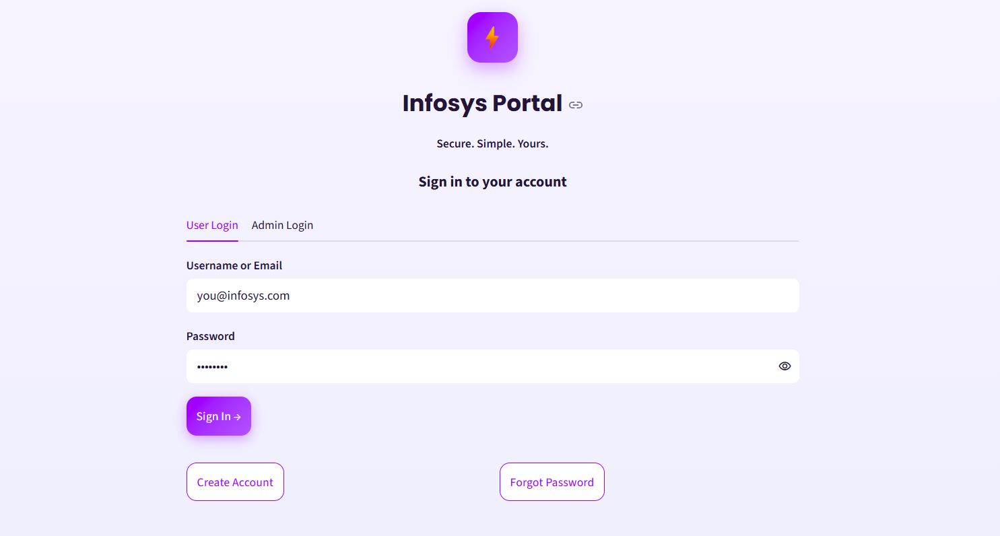
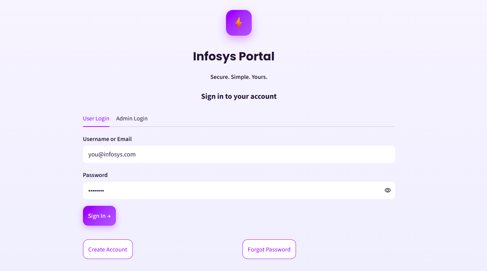
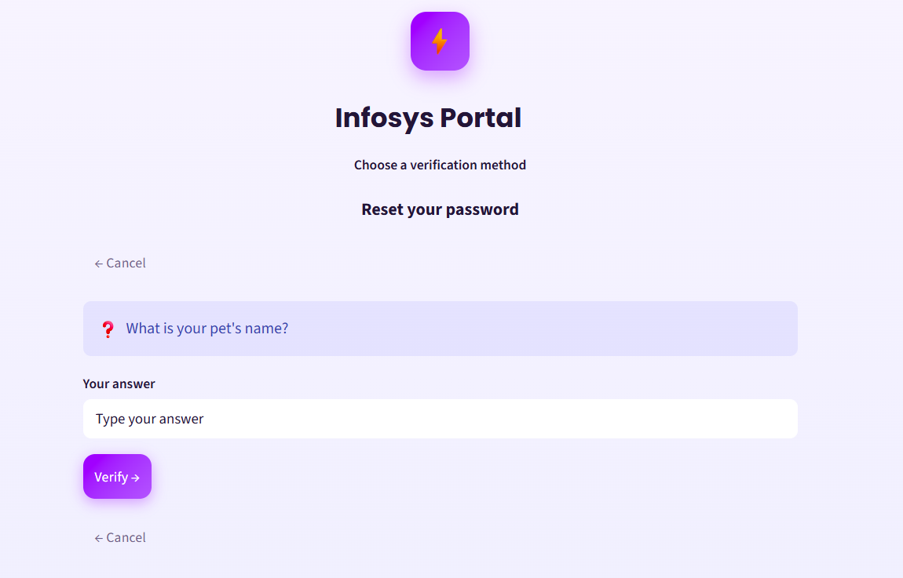
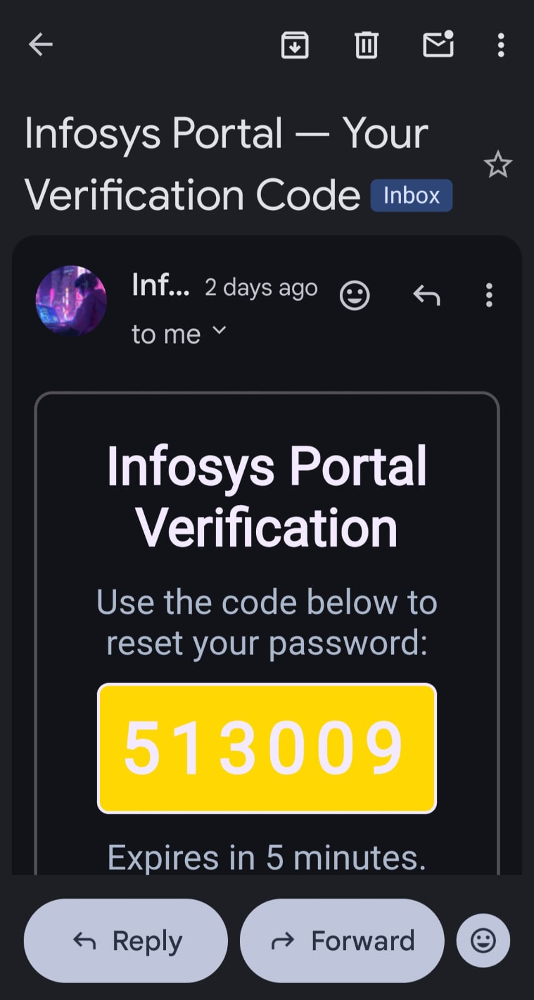
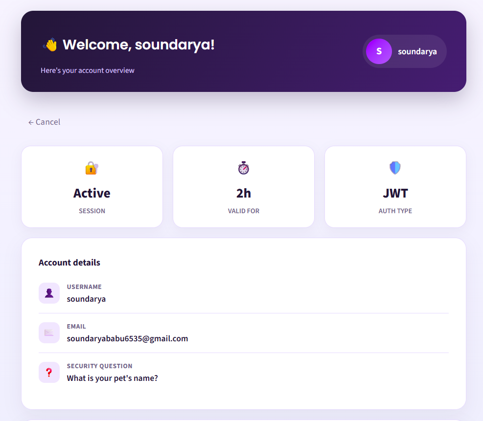
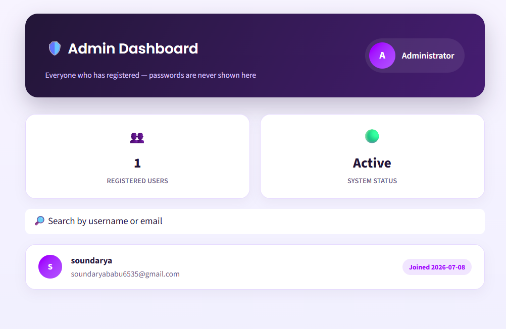

# Milestone 1 — User Authentication Module

**Infosys Springboard Internship 7.0 · Batch 1**

## What this milestone is

A self-contained authentication system built with Streamlit and made
publicly reachable from Google Colab via ngrok. It covers full account
lifecycle: signup, login, password recovery, and role-based dashboards,
with all secrets kept out of the codebase.

## Features built

- **Unified Login** — one form for both users and admin (username/email
  or admin username + password); JWT session issued on success; one
  generic error message on failure (never reveals which field was wrong)
- **Signup** — username, email, password + confirm, security question &
  answer, with **live field-by-field validation** (checks run as soon as
  you leave each field, not only on submit) — duplicate usernames/emails
  are caught immediately with a clear inline message
- **Forgot Password** — two independent recovery routes:
  - *Security Question* — answer the question set at signup, then set a new password
  - *Email OTP* — a 6-digit code emailed via Gmail, expires after 5 minutes
    (falls back to an on-screen preview if email isn't configured yet, so
    the flow can still be tested)
- **JWT session handling** — a signed token gates access to the dashboard;
  signup and password reset always route back to Login, never auto-login
- **Field validation** — mandatory-field checks, an email-shape rule
  (letters before `@`, letters between `@` and the dot, letters after
  the dot), and a password rule (8+ chars, upper, lower, number, symbol)
- **User Dashboard** — account details and live session info (signed-in
  time, expiry) pulled from the JWT and the in-memory user record
- **Admin Dashboard** — separate credentials (never a signup account);
  live-searchable list of every registered user's username/email
  (passwords are never displayed)

## Tech stack

| Layer            | Tool                                  |
|-------------------|---------------------------------------|
| UI                | Streamlit                             |
| Sessions          | PyJWT                                 |
| Password hashing  | bcrypt                                |
| Storage           | In-memory (`st.cache_resource`) — no database file |
| OTP delivery      | Gmail SMTP (App Password)             |
| Public tunneling  | ngrok (via pyngrok)                   |

> **Note:** there is no database file. Registered users live only in the
> running Streamlit process's memory and are lost if the process restarts.
> This keeps the project to a single file with nothing extra to set up.

## Files

- `app.py` — the entire app: unified login, signup, forgot password
  (both routes), user & admin dashboards, and the in-memory data layer
- `requirements.txt` — Python dependencies
- `Milestone1.ipynb` — the Colab notebook that writes `app.py`, installs
  dependencies, and launches it through ngrok

## Secrets (set in Colab Secrets, never hard-coded)

| Secret name       | Purpose                              |
|-------------------|---------------------------------------|
| `JWT_SECRET`      | Signs session & OTP tokens            |
| `NGROK_AUTHTOKEN` | Authenticates the ngrok tunnel        |
| `EMAIL_ADDRESS`   | Gmail address that sends OTP mail     |
| `EMAIL_PASSWORD`  | Gmail App Password (16 characters)    |
| `ADMIN_USERNAME`  | Admin login username (Step 11)        |
| `ADMIN_PASSWORD`  | Admin login password (Step 11)        |

If `ADMIN_USERNAME`/`ADMIN_PASSWORD` aren't set, the app falls back to
`admin` / `Admin@123` for local testing only — it shows a warning on the
Login page whenever this fallback is active, as a reminder to set real
values before deploying anywhere beyond your own testing.

## How to run (Google Colab)

1. Open `Milestone1.ipynb` in Colab (or upload `app.py` directly and
   skip the `%%writefile` cell).
2. Add the six secrets above via the Colab Secrets (key icon) panel,
   with notebook access enabled for each.
3. Run the cells top to bottom — install dependencies, write `app.py`,
   then launch (fetches secrets, starts Streamlit, opens an ngrok
   tunnel, prints the public URL).
4. Open the printed URL to use the app.

## Screenshots

   
  <em>Login</em>

   
  <em>Signup</em>

   
  <em>Forgot Password — Security Question</em>

   
  <em>OTP email received</em>

   
  <em>User Dashboard</em>

   
  <em>Admin Dashboard</em>

