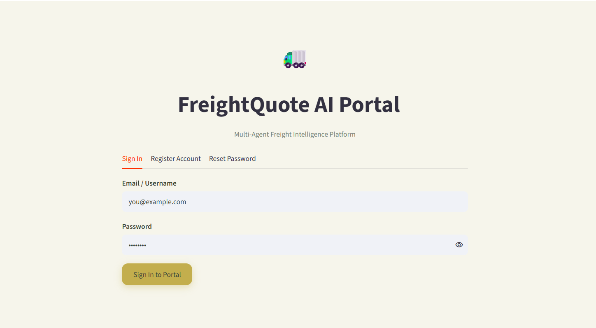
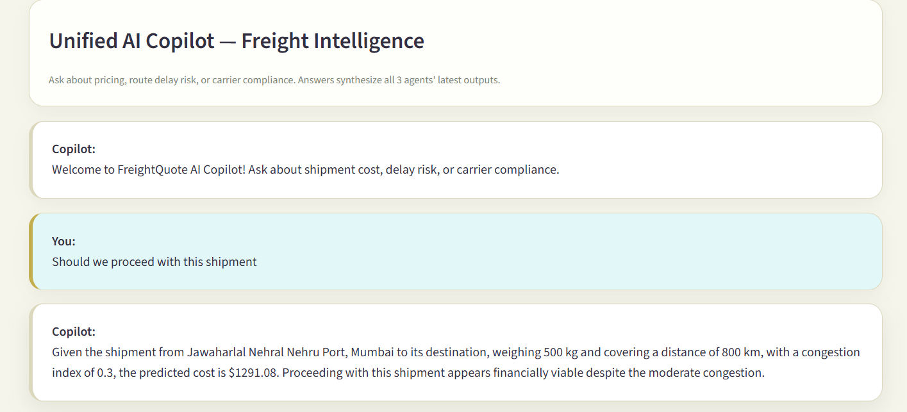
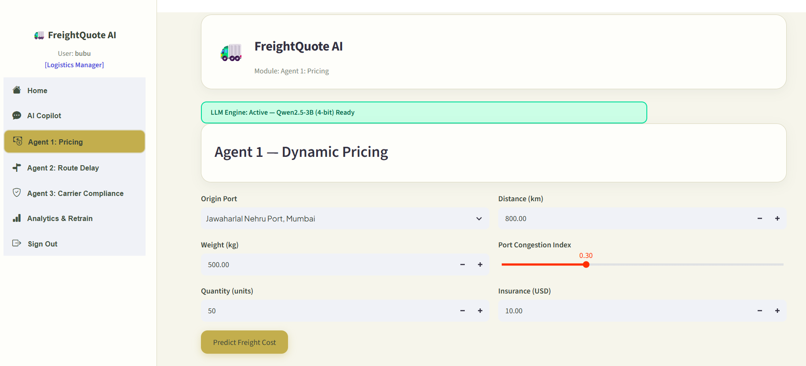
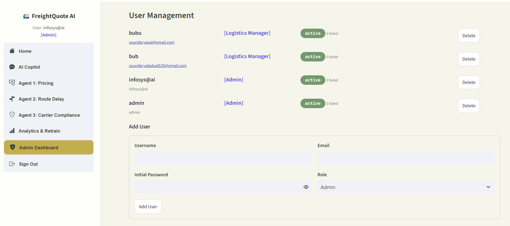
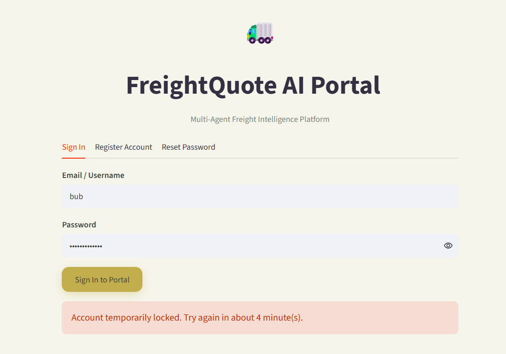

# Milestone 2 — Full-Stack AI/ML Integration & Advanced Security Engine

**Infosys Springboard Internship 7.0 · Batch 1 · FreightQuote AI Platform**

## What Milestone 2 adds on top of Milestone 1

Milestone 1 built the authentication gateway — JWT sessions, SQLite
credentials, and Gmail OTP verification. Milestone 2 unifies that
security gateway with a multi-agent ML core and an LLM Copilot, and adds
three hardening layers the base authentication system didn't have:

- **Progressive account lockout** — 3rd failed login locks the account
  for 5 minutes, 4th for 15 minutes, 5th permanently (until an Admin
  unlocks it)
- **OTP resend cooldown** — escalating wait times (60s → 3min → 5min → 1hr)
  to stop OTP spam
- **Live password strength checking** — Weak / Average / Good badges
  shown as you type, on both registration and password reset

On top of that hardening, this milestone adds:

- **3 autonomous ML agents**, each trained by comparing 5+ algorithms on
  real Kaggle logistics data (with a tested synthetic-data fallback if
  Kaggle credentials aren't available)
- **An LLM Copilot** (Qwen2.5-3B-Instruct, 4-bit quantized) that
  synthesizes all 3 agents' outputs into an executive answer and a
  structured JSON audit action — with a rule-based fallback if no GPU
  is available, so the Copilot page never just breaks
- **A full Admin Dashboard** — Add User, Delete User, Unlock Account,
  system health, LLM activity monitoring, and an ML Model Card showing
  every agent's champion metrics

## Features built

| Area | What it does |
|---|---|
| Unified Login | Single sign-in for both regular users and Admin, gated by JWT |
| Progressive Lockout | 5/15-minute timed locks, then permanent lock after the 5th failure |
| Password Strength | Real-time Weak/Average/Good badge, blocks sub-5-character passwords |
| Forgot Password | Security Question **or** Email OTP, both with cooldown protection |
| Agent 1 — Dynamic Pricing | Regression on shipment weight/distance/congestion; predicts freight cost |
| Agent 2 — Route Delay Classifier | Classifies delay risk from transit time, congestion, and weather |
| Agent 3 — Carrier Compliance Sentinel | Flags carrier compliance risk from on-time rate, damage rate, violations |
| AI Copilot | Chat interface, "Debate View" (per-agent breakdown), and a JSON audit-action generator |
| Admin Dashboard | User lifecycle (Add/Delete/Unlock), GPU/system health, ML Model Card, live alert log |

## Tech stack

| Layer | Tool |
|---|---|
| UI | Streamlit + streamlit-option-menu |
| Sessions | PyJWT |
| Password hashing | bcrypt |
| Storage | SQLite |
| ML | scikit-learn (5+ algorithms per agent), joblib |
| LLM | Qwen2.5-3B-Instruct, 4-bit NF4 via bitsandbytes + transformers |
| Data | kagglehub (real data) with synthetic fallback |
| Public tunneling | ngrok (via pyngrok) |

## System architecture — 4 phases

| Phase | Module | Responsibility |
|---|---|---|
| 1. Security Gateway | `auth.py` | Login, Registration, Forgot Password (Security Question / Gmail OTP), progressive lockout, hashed credentials in SQLite |
| 2. Domain Intelligence | `agents_freight.py` | Once authenticated: Agent 1 Dynamic Pricing, Agent 2 Route Delay Classifier, Agent 3 Carrier Compliance Sentinel |
| 3. Generative Advisory | `llm_engine_freight.py` | Synthesizes the 3 agents' numeric outputs into an executive strategy and a structured JSON audit action |
| 4. System Administration | `admin_dash.py` | Add/Delete/Unlock users, GPU health, ML Model Card — restricted to `role = 'Admin'` |

## Indian port coverage

| Code | Port |
|---|---|
| JNPT | Jawaharlal Nehru Port, Mumbai |
| MUNDRA | Mundra Port, Gujarat |
| CHENNAI | Chennai Port, Tamil Nadu |
| COCHIN | Cochin Port, Kerala |

## Files

- `app.py` — orchestrator: auth gate, sidebar navigation, Home/KPI page, tab routing
- `auth.py` — login, registration, forgot password, lockout, password strength, OTP
- `db.py` — SQLite schema and data access (users, ml_models, chat_history, notifications)
- `config.py` — secrets loading, file paths, port coverage data
- `ui_theme.py` — shared styling (cards, badges, theme)
- `admin_dash.py` — Admin Dashboard (user lifecycle, system health, ML Model Card)
- `agents_freight.py` — the 3 agent UIs (Pricing, Route Delay, Carrier Compliance)
- `train_ml_freight.py` — trains 5+ algorithms per agent, saves champions, logs metrics
- `llm_engine_freight.py` — Qwen2.5-3B loading + inference + rule-based fallback
- `requirements.txt` — Python dependencies
- `FreightQuote_AI_Milestone2.ipynb` — the Colab notebook tying it all together

## Colab Runtime, GPU & Secrets Setup

### Switch the runtime to GPU
1. Runtime → Change runtime type → **T4 GPU** → Save
2. Run `!nvidia-smi` as your first cell to confirm the GPU is attached

### Create a Kaggle API token (recommended, not required)
1. kaggle.com → profile picture → Settings → API → **Create New Token**
2. This downloads `kaggle.json` containing a username and key
3. Add both as Colab Secrets below — the training pipeline works fine on
   synthetic data without this, per Section 3.2 of the assignment

### Store all secrets in Colab Secrets (never hard-coded)

Click the key icon in the left sidebar, add each of these, and toggle
notebook access **on** for each:

| Secret | Purpose |
|---|---|
| `JWT_SECRET` | Signs & verifies login session tokens — any long random string |
| `ADMIN_USERNAME` | Bootstraps your primary Admin account (fallback: `infosys@ai`) |
| `ADMIN_PASSWORD` | Password for that Admin account (fallback: `admin@123`) |
| `NGROK_AUTHTOKEN` | Gives the Streamlit app a public HTTPS URL |
| `HF_TOKEN` | Authenticates HuggingFace for the Qwen2.5-3B Copilot |
| `EMAIL_ADDRESS` | Gmail address that sends OTP/alert emails (optional — console fallback works without it) |
| `EMAIL_PASSWORD` | Gmail App Password (Gmail → 2-Step Verification → App Passwords) |
| `KAGGLE_USERNAME` / `KAGGLE_KEY` | Optional — from `kaggle.json`, trains agents on real data |

**Two admin accounts are always available:** the one built from
`ADMIN_USERNAME`/`ADMIN_PASSWORD` above, plus a guaranteed fallback
(`infosys@ai` / `admin@123`) that's seeded regardless — so a typo in
your own secret never fully locks you out of the Admin Dashboard.

## How to run

1. Open `FreightQuote_AI_Milestone2.ipynb` in Colab with a T4 GPU attached
2. Add the secrets above via Colab Secrets
3. Run the cells top to bottom: install dependencies → write each module →
   train the agents (`train_ml_freight.py`) → launch via ngrok
4. Open the printed public URL, log in, and verify each item in Section
   10.1 of the assignment (login, Home KPIs, Copilot response, pricing
   prediction, Admin Panel metrics, lockout/cooldown/strength badges)

## What's been tested vs. what needs your own verification

Everything in this project was tested where it's possible to test it
without a GPU or live Kaggle/HuggingFace access:

- **Fully tested, with real logged output:** the entire lockout escalation
  (3rd→5min→4th→15min→5th→permanent→admin unlock), password strength
  tiers, OTP cooldown escalation, Add/Delete/Unlock through the real
  Admin Dashboard UI, all 3 agents' predictions against their actual
  trained models, the full training pipeline (synthetic-data path,
  Agent 1 R² confirmed ≥ 0.90), the LLM Copilot's rule-based fallback
  path, and all 7 app tabs booting with zero exceptions end to end.
- **Needs your own Colab+GPU run to confirm:** the real Kaggle-download
  path for each dataset (column names are assumed defensively — check
  `train_ml_freight.py`'s `req_cols` checks against what actually
  downloads), and the real Qwen2.5-3B GPU inference path in
  `llm_engine_freight.py` (the code mirrors the mentor's tested loading
  pattern, but there's no GPU in this environment to load a 3B model on).

## Screenshots

   
  <em>Home page</em>

   
  <em>AI Copilot (prompt + response)</em>

   
  <em>ML Pricing Calculator (input + predicted cost)</em>

   
  <em>Admin Panel → ML Model Card tab</em>

   
  <em>Admin Panel → Add / Delete / Unlock user actions</em>

   
  <em>Triggered lockout message and OTP cooldown message</em>

